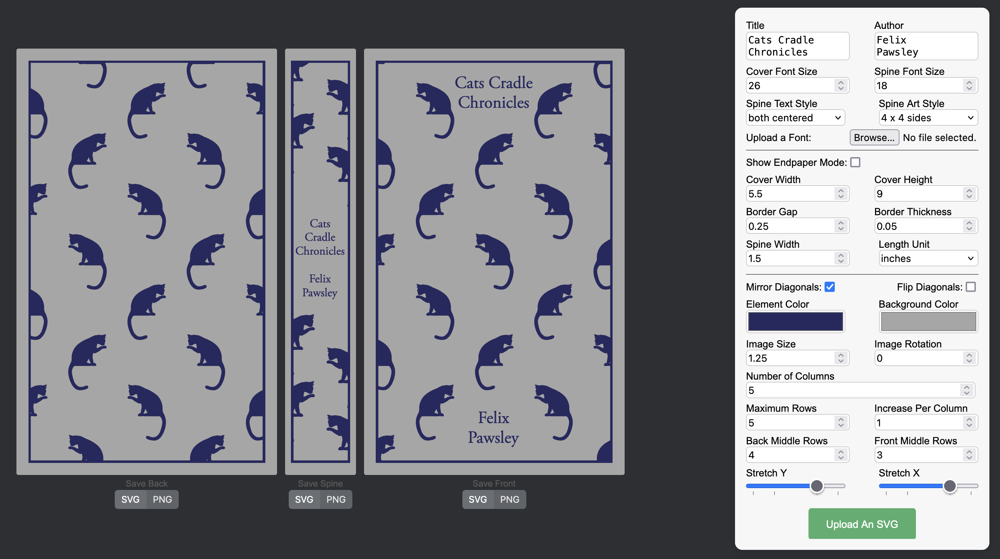

#  Book Cover JS

 Bookcover-js is a web application that allows users to generate penguin clothbound classics style book covers with their own SVG images. The generated covers are also presented in SVG format suitable for use with a cricut or silhoutte or other cutting plotter.

click --> [HERE](https://acestronautical.github.io/bookcover-js/) <-- to use

## Offline Usage

1. Download the repository with this [link](https://github.com/acestronautical/bookcover-js/archive/refs/heads/main.zip)
2. Decompress the zip file
3. Open `index.html` in any web browser.

## Dependencies

The project does not have any external dependencies and can be run directly in a web browser without additional setup.

## Contributing

Contributions are welcome! If you'd like to contribute to the project, please fork the repository, make your changes, and submit a pull request. If you have any features you desire, or notice any bugs please create an issue. Thanks!

## License

This project is licensed under the Mozilla Public License. See the [LICENSE](LICENSE) file for details.

## Disclaimer

This project is provided as open-source software free of charge. Its main objective is to automate the tessellation of SVG images onto a book cover format. Any similarity to trademarked content owned by Penguin Random House LLC or its usage for the creation of covers resembling those owned by Penguin Random House LLC is solely at the discretion of the user. The creator of this project disclaims any ownership or affiliation with the intellectual property of Penguin Random House LLC.
